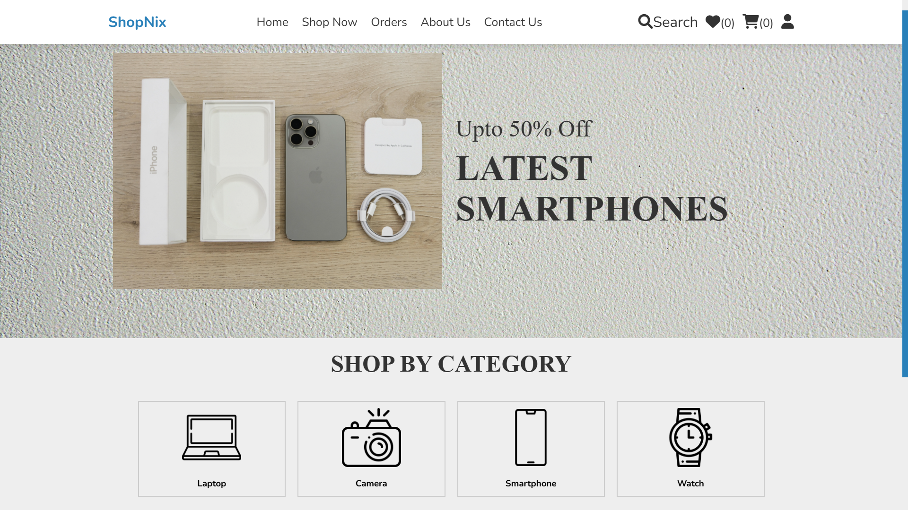
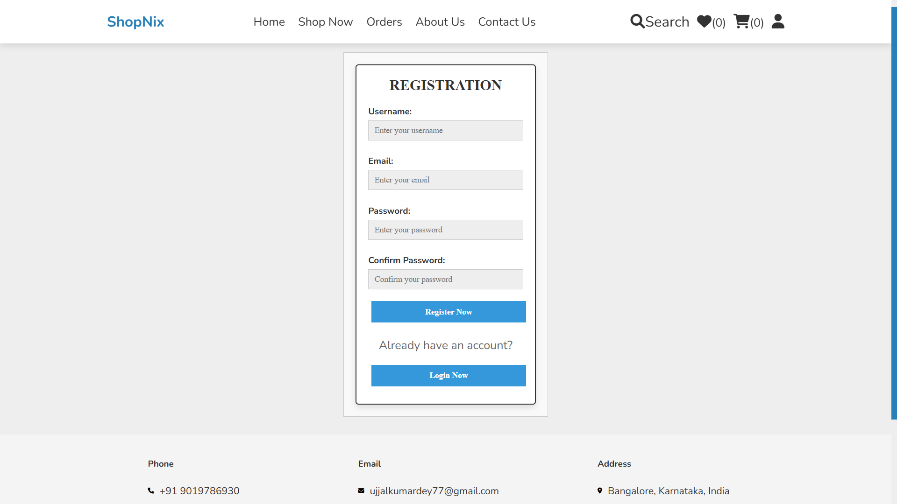
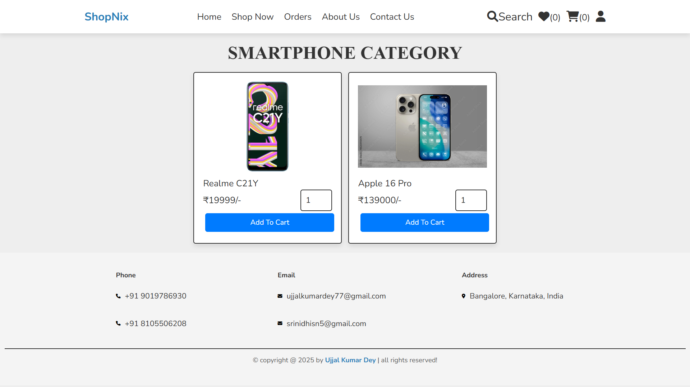
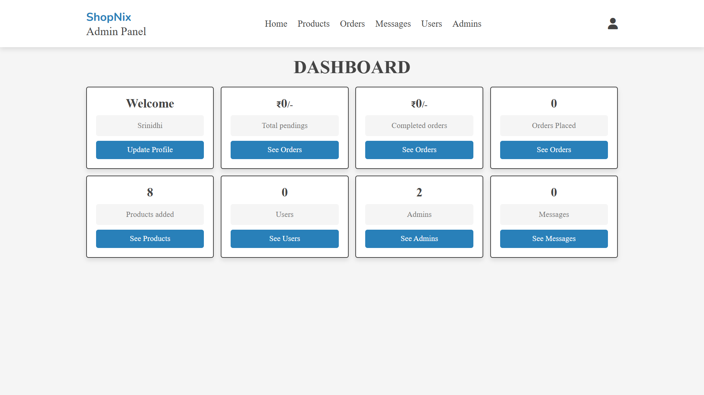

# 🛒 Shop Nix – Electronics eCommerce Website

A full-featured electronics eCommerce website built using **HTML, CSS, JavaScript, PHP, and MySQL**. It supports both **user** and **admin login**, showcases products by category, allows cart and wishlist management, and features a clean, animated UI inspired by Netflix’s intro style.

## 🚀 Features


- 🔐 **User & Admin Login/Register**
- 🛍️ **Shop by Categories** – Laptop, Smartphone, Camera, and Watch
- ❤️ **Wishlist & Cart Functionality**
- 🛒 **Product Purchase and Order Simulation**
- 📦 **Admin Dashboard for Product Management**
- 📜 **Order History and Management**
- 📱 **Responsive Design using Flexbox and Swiper.js**

---

## 📂 Project Structure

```
📁 E-Commerce                         # Root project directory
│
│── admin/                           # Backend admin panel pages
│   ├── admin_accounts.php          # Manage admin users
│   ├── admin_login.php             # Admin login page
│   ├── dashboard.php               # Admin dashboard overview
│   ├── messages.php                # View messages submitted by users
│   ├── placed_orders.php           # View all customer orders
│   ├── products.php                # Admin interface to add/manage products
│   ├── register_admin.php          # Register new admin users
│   ├── update_product.php          # Edit existing product information
│   ├── update_profile.php          # Admin profile update page
│   ├── users_accounts.php          # View registered user accounts
│
│── components/                     # Reusable PHP components (included in various pages)
│   ├── admin_header.php            # Admin panel header navigation
│   ├── admin_logout.php            # Logout script for admin
│   ├── connect.php                 # MySQL database connection file
│   ├── footer.php                  # Site-wide footer section
│   ├── user_header.php             # Header navigation for user pages
│   ├── user_logout.php             # Logout script for users
│   ├── wishlist_cart.php           # Handles wishlist/cart add/remove actions
│
│── css/                            # Stylesheets
│   ├── admin_style.css             # Styles for admin dashboard and pages
│   ├── style.css                   # Styles for user-facing frontend
│
│── images/                         # Contains product and UI images
│
│── js/                             # JavaScript files for interactivity
│   ├── admin_script.js             # Admin panel-specific JS (form validation, AJAX, etc.)
│   ├── script.js                   # Frontend JS for features like sliders, animations
│
│── uploaded_img/                   # Uploaded product images by admin
│
│── README.md                       # Project documentation file (usage, structure, setup)
│
├── about.php                       # About page with company/project info
├── cart.php                        # Shopping cart page
├── category.php                    # Displays products by category
├── checkout.php                    # Checkout page to confirm and place orders
├── contact.php                     # Contact form for customer support
├── home.php                        # Main landing page with slider/banner
├── orders.php                      # View user's past orders
├── quick_view.php                  # Quick product preview popup or page
├── search_page.php                 # Displays search results from user input
├── shop.php                        # Main product listing/shop page
├── shop_db.sql                     # SQL dump of database schema and sample data
├── update_user.php                 # Allows users to update their profile
├── user_login.php                  # User login page
├── user_register.php               # User registration page
├── wishlist.php                    # Wishlist page to view saved items

```

---

## ⚙️ Installation

### 🔹 1. Clone the Repository

```bash
git clone https://github.com/Ujjal57/E-Commerce.git
cd E-Commerce
```

### 🔹 2. Set Up XAMPP

- Install [XAMPP]
- Start **Apache** and **MySQL** services
- Copy the project folder to:

```makefile
C:\xampp\htdocs\E-Commerce
```

### 🔹 3. Create and Import Database

- Go to [http://localhost/phpmyadmin](http://localhost/phpmyadmin)
- Create a new database: `shop_db`
- Import `shop_db.sql` file into the new database

### 🔹 4. Run the Website

Open in your browser for user:

```arduino
http://localhost/E-Commerce
```
Open in your browser for admin:

```arduino
http://localhost/E-Commerce/admin/admin_login.php
```

---

## 🛠️ How It Works

- **User Registration & Login** – Users and Admins can securely sign in.
- **Intro Animation** – A one-time animated "Shop Nix" text overlay on load.
- **Browse Products** – Products shown by category with hover animations.
- **Wishlist & Cart** – Add products to your cart or wishlist.
- **Order Placement** – Simulate buying items (no real payment processing).
- **Admin Dashboard** – Admin can add/edit/delete products and view orders.

---

## 🖼️ Screenshots

<p>
  <em>Intro Animation</em><br>
  
</p>

<p>
  <em>Home Page</em><br>
  
</p>

<p>
  <em>Register Page</em><br>
  
</p>

<p>
  <em>Cart Page</em><br>
  
</p>

<p>
  <em>Admin Dashboard</em><br>
  
</p>

---

## 🔐 Admin Panel Access

You can log in as admin using:

```makefile
Username: Ujjal
Password: Ujjal
```

⚠️ Ensure these credentials exist in your database or insert them manually using phpMyAdmin.

---

## 🔮 Future Enhancements

- ✅ Add real payment gateway (Razorpay/Stripe)
- ✅ Add product ratings and reviews
- ✅ Implement search bar with filters
- ✅ Enable product quantity stock control
- ✅ Add delivery tracking simulation
- ✅ Responsive PWA support for mobile view

---

## 👨‍💻 Developer

**Ujjal** – *Full Stack Developer*
